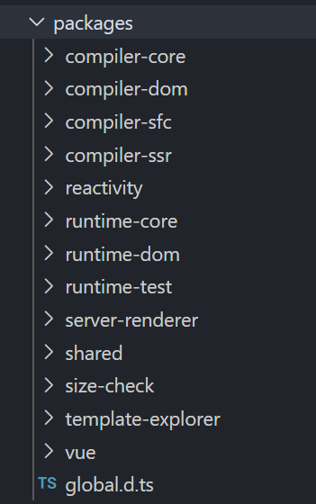
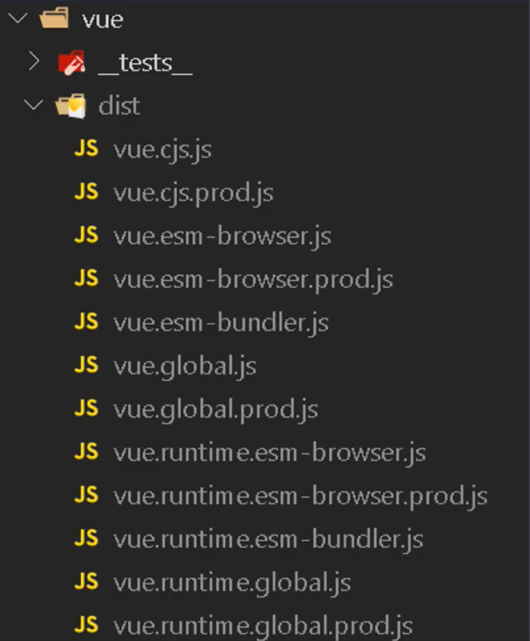
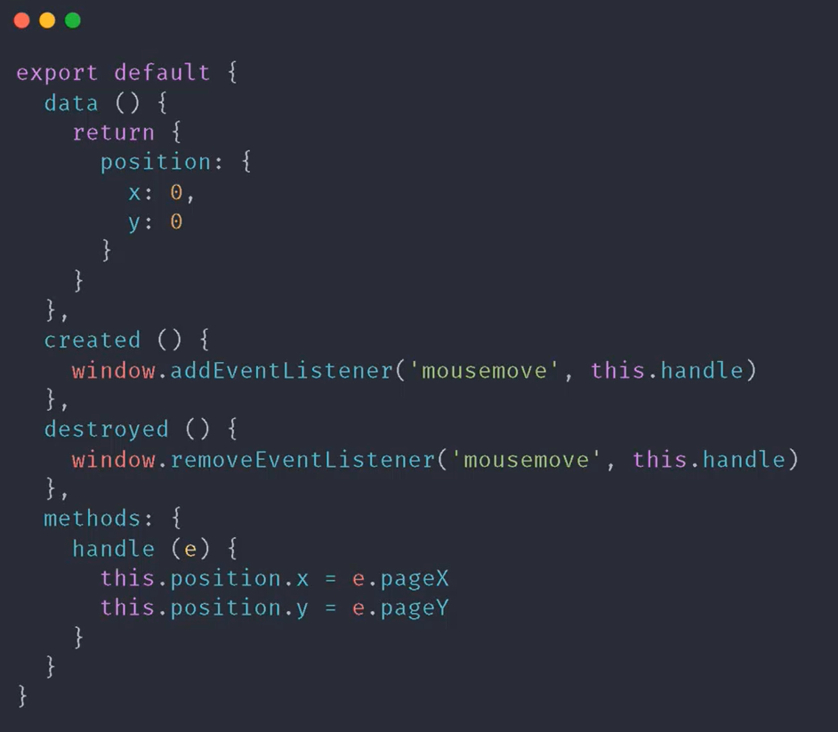
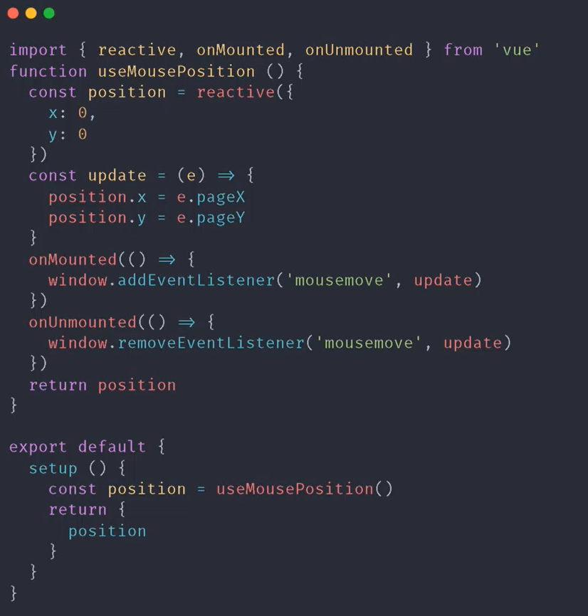

# Vue 3.0 介绍

### Vue.js 3.0 和 Vue.js 2.x 的区别

- 源码组织方式的变化

  - 源码采用 TypeScript 重写
  - 使用 Monorepo 管理项目结构
  - 独立的功能模块提取到不同的包中

- Composition API （组合 API）

  - 解决 Vue 2.x 开发大型项目时，遇到超大组件 使用 options api 不好拆分重用的问题

- 性能提升

  - 使用 Proxy 代理对象重写了响应式的代码
  - 对编译器做了优化，重写了虚拟 DOM，从而让渲染和 update 有了大幅度的提升
  - 服务端渲染性能提升了 2~3 倍

- Vite

  - 开发测试阶段不需要打包直接运行项目，提升开发效率

### 源码中 packages 目录结构



- packages 目录下都是独立发行的包，可以独立使用
- compiler-core 根平台无关的编译器
- compiler-dom 浏览器平台下的编译器，依赖于 compiler-core
- compiler-sfc 编译单文件组件，依赖于 compiler-core 、 compiler-dom
- compiler-ssr 服务端渲染编译器，依赖于 compiler-dom
- reactivity 数据响应式系统，可以独立使用
- runtime-core 和平台无关的运行时
- runtime-dom 针对浏览器的运行时，处理原生 dom api、事件等
- runtime-test 专门为测试而编写的一个轻量级运行时，由这个运行时渲染出来的 DOM 树是一个 js 对象，这个运行时可以运行在所有 js 环境里，可以用它来测试渲染是否正确，还可以用来序列化 DOM、触发 DOM 事件，以及记录某次更新中的 DOM 操作
- server-renderer 用于服务端渲染
- shared Vue 内部使用的一些公共 api
- size-check 私有的包，不会发布到 npm，作用是在 tree shaking 之后检查包的大小
- template-explorer 在浏览器运行的实时组件，它会输出 render 函数
- vue 构建完整版的 vue，依赖于 runtime、compiler

### Vue.js 3.0 不同构建版本

> 和 Vue 2.x 的不同，Vue 3.0 不再构建 umd 模块化的方式，因为 umd 模块化的方式会让代码有更多的冗余。Vue 3.0 构建版本中，把 cjs、esmodule 和自执行函数的方式，分别打包到不同的文件当中。



- cjs (commonJS 模块化方式)

  - vue.cjs.js
  - vue.cjs.prod.js

- global

  - vue.global.js
  - vue.global.prod.js
  - vue.runtime.global.js
  - vue.runtime.global.prod.js

- browser (esModules 浏览器原生的模块化方式)

  - vue.esm-browser.js
  - vue.esm-browser.prod.js
  - vue.runtime.esm-browser.js
  - vue-runtime.esm-browser.prod.js

- bundler

  - vue.esm-bundler.js
  - vue.runtime.esm-bundler.js

### Composition API 设计动机

- RFC(Request For Comments)

  - https://github.com/vuejs/rfcs

- Composition API RFC

  - https://composition-api.vuejs.org

**Vue 2.x**

- Options API

  - 包含一个描述组件选项（data、methods、props 等）的对象
  - Options API 开发复杂组件，同一个功能逻辑的代码被拆分到不同选项

  

- Composition API

  - Vue.js 3.0 新增的一组 API
  - 一组基于函数的 API
  - 可以更灵活的组织组件的逻辑

  

### 性能提升

- 响应式系统升级
- 编译优化
- 源码体积的优化

**响应式系统升级**

- Vue.js 2.x 中响应式系统的核心 defineProperty
- Vue.js 3.0 中使用 Proxy 对象重写响应式系统

  - 可以监听动态新增的属性
  - 可以监听删除的属性
  - 可以监听数组的索引和 length 属性

**编译优化**

- Vue.js 2.x 中通过标记静态根节点，优化 diff 的过程

  - 静态节点还需要 diff ,这个过程没有被优化

- Vue.js 3.0 中标记和提升所有的静态根节点，diff 的时候只需要对比动态节点内容

  - Fragments (升级 vetur 插件)
  - 静态提升
  - Patch flag
  - 缓存事件处理函数

**优化打包体积**

- Vue.js 3.0 中移除了一些不常用的 API

  - 例如：inline-template、filter 等(最终让代码体积减小)

- Tree-shaking（支持更好）

### Vite(快)

**Vite as Vue-CLI**

- Vite 在开发模式下不需要打包可以直接运行
- Vite 在生产环境下使用 Rollup 打包

  - 基于 ES Module 的方式打包

- Vue-CLI 开发模式下必须对项目打包才可以运行
- Vue-ClI 在成产环境下使用 Webpack 打包

**Vite 特点**

- 快速冷启动
- 按需编译
- 模块热更新

**Vite 创建项目**

- Vite 创建项目

```
npm init vite-app <project-name>
cd <project-name>
npm install
npm run dev
```

- 基于模板创建项目

```
npm init vite-app --template react
npm init vite-app --template preact
```
