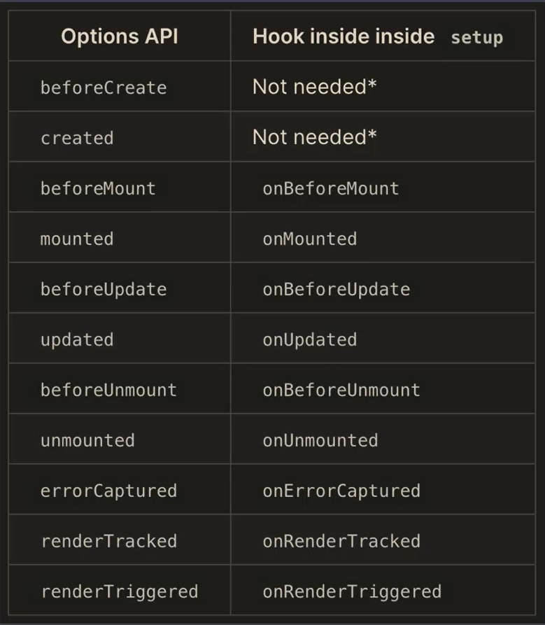

## Composition API

- createApp

  - 用于创建 vue 对象

- setup

  - Composition API 的入口

- reactive

  - 用于创建响应式对象

### 生命周期钩子函数



### reactive/toRefs/ref (都是创建响应式数据的函数)

**reactive**

- 把对象转换成响应式对象，是一个代理对象

**ref**

- 把基本类型的数据转换成响应式对象

**toRefs**

- 把一个代理对象的所有属性都转换成响应式对象，在处理对象属性的时候类似于 ref
- 通过 toRefs 处理 reactive 返回的代理对象，可以进行解构操作

### Computed

- 第一种用法

  - watch(() => count.value + 1)

- 第二种用法

  - 传入一个对象，这个对象具有 get、set，返回一个不可变的响应式对象

```js
const count = ref(1);
const plusOne = computed({
  get: () => count.value + 1,
  set: (val) => {
    count.value = val - 1;
  },
});
```

- 作用

  - 可以创建响应式的数据，这个响应式数据依赖于其它的响应式数据，当依赖的数据发生变化后，会重新计算属性传入的这个函数

### Watch 监听器

- Watch 的三个参数

  - 第一个参数：要监听的数据
  - 第二个参数：监听到数据变化后执行的函数，这个函数有两个参数分别是新值和旧值
  - 第三个参数：选项对象，deep 和 immediate

- Watch 的返回值

  - 取消监听的函数

### WatchEffect

- 是 watch 函数的简化版本，也用来监视数据的变化
- 接受一个函数作为参数，监听函数内响应式数据的变化
