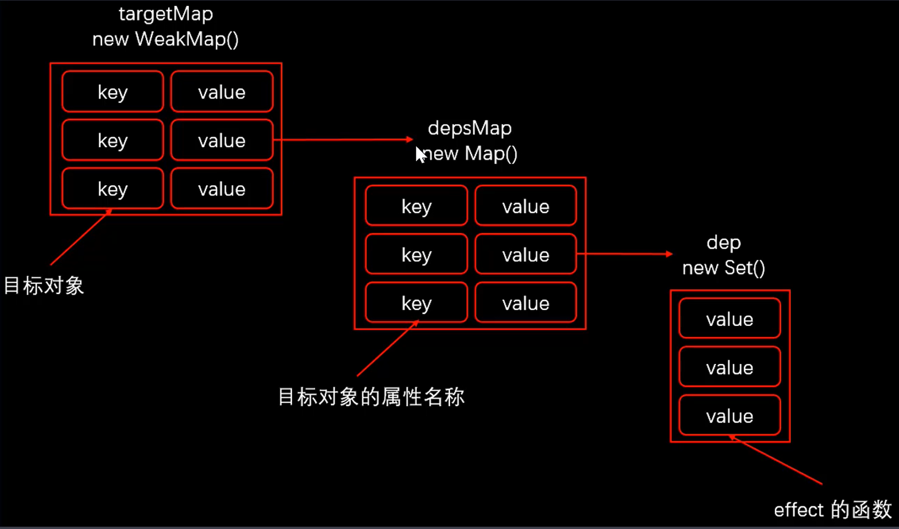

# Vue.js 3.0 响应式系统原理

### Vue.js 3.0 响应式回顾

- Proxy 对象实现属性监听，初始化的时候不需要遍历所有的属性，再把属性通过 defineProperty 转换成 get 和 set
- 如果有多层属性嵌套，只有在访问属性过程中才会递归处理下一级属性
- 默认监听动态添加的属性
- 默认监听属性的删除操作
- 默认监听数组索引和 length 属性
- 可以作为单独的模块使用

### 核心方法

- reactive / ref / toRefs / computed
- effect
- track
- trigger

### Proxy 对象回顾

- 问题 1：set 和 deleteProperty 中需要返回布尔类型的值

  - 在严格模式下，如果返回 false 的话会出现 Type Error 的异常

- 问题 2：Proxy 中 receiver：Proxy 或者继承 Proxy 的对象

  - Reflect 中 receiver: 如果 target 对象中设置了 getter，getter 中的 this 指向 receiver

### reactive

- 接收一个参数，判断这参数是否是对象
- 创建拦截器对象 handler，设置 get /set / deleteProperty
- 返回 Proxy 对象

**模拟实现**

```js
const isObject = (val) => val !== null && typeof val === "object";
const convert = (target) => (isObject(target) ? reactive(target) : target);
const hasOwnProperty = Object.prototype.hasOwnProperty;
const hasOwn = (target, key) => hasOwnProperty.call(target, key);

export function reactive(target) {
  if (!isObject(target)) return target;

  const handler = {
    get(target, key, receiver) {
      // 收集依赖
      track(target, key);
      const result = Reflect.get(target, key, receiver);
      return convert(result);
    },
    set(target, key, value, receiver) {
      const oldValue = Reflect.get(target, key, receiver);
      let result = true;
      if (oldValue !== value) {
        result = Reflect.set(target, key, value, receiver);
        // 触发更新
        trigger(target, key);
      }
      return result;
    },
    deleteProperty(target, key) {
      const hadKey = hasOwn(target, key);
      const result = Reflect.deleteProperty(target, key);
      if (hadKey && result) {
        // 触发更新
        trigger(target, key);
      }
      return result;
    },
  };

  return new Proxy(target, handler);
}
```

### 收集依赖



### effect / track

```js
let activeEffect = null;
export function effect(callback) {
  activeEffect = callback;
  callback(); // 访问响应式对象属性，去收集依赖
  activeEffect = null;
}

let targetMap = new WeakMap();

export function track(target, key) {
  if (!activeEffect) return;
  let depsMap = targetMap.get(target);
  if (!depsMap) {
    targetMap.set(target, (depsMap = new Map()));
  }
  let dep = depsMap.get(key);
  if (!dep) {
    depsMap.set(key, (dep = new Set()));
  }
  dep.add(activeEffect);
}
```

### trigger

```js
export function trigger(target, key) {
  const depsMap = targetMap.get(target);
  if (!depsMap) return;
  const dep = depsMap.get(key);
  if (dep) {
    dep.forEach((effect) => {
      effect();
    });
  }
}
```

### ref

```js
export function ref(raw) {
  // 判断 raw 是否是ref 创建的对象，如果是的话直接返回
  if (isObject(raw) && raw.__v_isRef) {
    return;
  }
  let value = convert(raw);
  const r = {
    __v_isRef: true,
    get value() {
      track(r, "value");
      return value;
    },
    set value(newValue) {
      if (newValue !== value) {
        raw = newValue;
        value = convert(raw);
        trigger(r, "value");
      }
    },
  };
  return r;
}
```

**reactive vs ref**

- ref 可以把基本数据类型数据，转成响应式对象
- ref 返回的对象，重新赋值成对象也是响应式的
- reactive 返回的对象，重新赋值丢失响应式
- reactive 返回的对象不可以解构

### toRefs

```js
export function toRefs(proxy) {
  const ret = proxy instanceof Array ? new Array(proxy.length) : {};

  for (const key in proxy) {
    ret[key] = toProxyRef(proxy, key);
  }

  return ret;
}

function toProxyRef(proxy, key) {
  const r = {
    __v_isRef: true,
    get value() {
      return proxy[key];
    },
    set value(newValue) {
      proxy[key] = newValue;
    },
  };
  return r;
}
```

### computed

```js
export function computed(getter) {
  const result = ref();

  effect(() => (result.value = getter()));

  return result;
}
```
