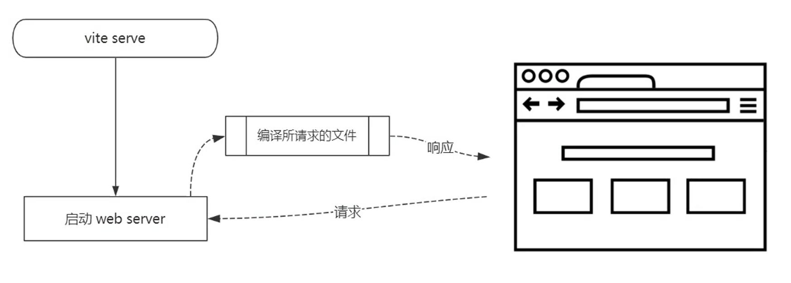

# Vite 实现原理

**Vite 概念**

- Vite 是一个面向现代浏览器的一个更轻、更快的 Web 应用开发工具
- 它基于 ECMAScript 标准原生模块系统（ES Modules）实现

**Vite 项目依赖**

- Vite
- @vue/compiler-sfc

**基础使用**

- vite serve (开启一个 web 开发服务器，启动服务器的时候不需要编译所有的代码文件，启动速度非常快)
- vite build

**HMR**

- Vite HMR

  - 立即编译当前所修改的文件

- Webpack HMR

  - 会自动以这个文件为入口重写 build 一次，所有的涉及到的依赖也都会被加载一遍

**Build**

- vite build

  - Rollup
  - Dynamic import

    - Polyfill

**开箱即用**

- TypeScript - 内置支持
- less / sass / stylus / postcss - 内置支持 （需要单独安装）
- JSX
- Web Assembly

**Vite 特性**

- 快速冷启动
- 模块热更新
- 按需编译
- 开箱即用
